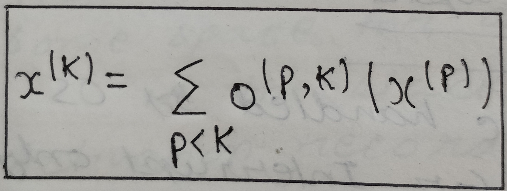
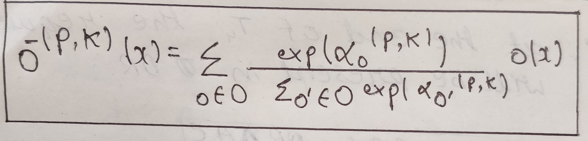
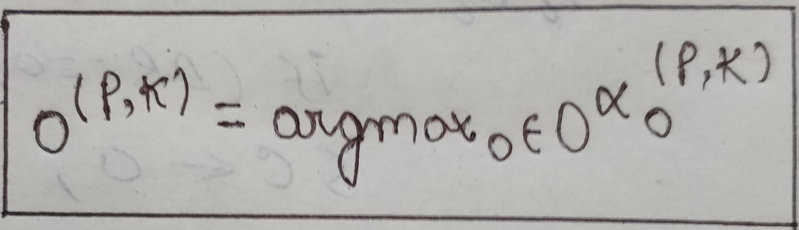
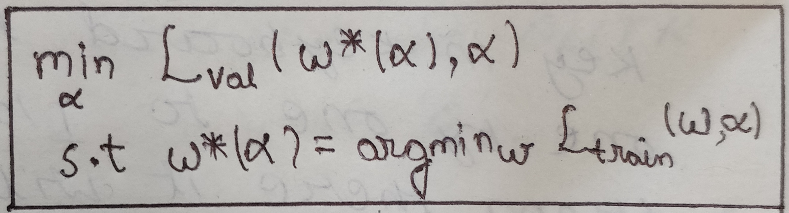

**Introduction**

Machine learning has changed the way of living. The computer science algorithms combined with data help machines learn in the way humans learn and make decisions. Our learning has been focussed on neural networks which comes under the umbrella of deep learning. The term neural network comes from neurons. Nodes, input layers, hidden layers and output layer together compose to make the Artificial Neural Networks.\
There also develops a need of building an optimized model for the dataset. A lot of architectural engineering is needed to choose the optimized model because selecting the best hyperparameters require human intervention and time.To select the best candidate architecture model, it takes a lot of manual effort, so NAS solves this problem because it works as an expert to choose the best model from the child models we get. DARTS is one of the approaches under NAS, which we have used in our project. Our project aims to classify the 11K hands dataset images into male or female(gender based recognition). The input to the model will be the hand images and by using DARTS we need to generate the most optimized model for classifying the gender. Earlier works include the building of the Convolutional Neural Network to classify the gender using the same dataset and an accuracy of 95% was recorded. Using DARTS we aim to best tune the hyperparameters so the most optimized model could be generated which might also set a higher accuracy compared to the other deep learning methods.

**Neural Architecture Search**

To get the best model for some dataset, hyperparameter tuning is being taken care of. There becomes a need for optimized architectures such that there is no overfitting on the training dataset. But to come up with the best model manually becomes difficult. It becomes computationally expensive to find the optimized architecture. So, for solving this problem Neural Architecture Search is used. NAS automates the process of finding the best architecture using the search strategy in the search space. There are three important terms for Neural Architecture Search:

**Search Space:**
To build a valid network, the network operations and how they are connected so as to construct an optimized design for the model defines the search space.   
**Search strategy:**
The search space is explored in the search strategy to generate the child models which generate high performance.\
**Performance Estimation:**
As the name suggests, this measure helps to check or predict the performance of the child models obtained.\
There can be multiple architectures possible from a large search space.

For search space NAS uses cells of two types in constructing the network.

• The first one is the **Normal cell** in which there is the same dimension provided for input and output feature map.\
• The second one is the **Reduction cell** in which there is a reduction of width and height of the output feature map by 2.

The NAS works on the principle to get the analysis of every child model's performance so that the optimizing algorithm can be generated using the feedback from the performance analysis. So this process to find the best child model is computationally expensive.

**Is it time consuming to automate the process of finding the optimized Architecture?**\
 Due to large search space, it takes around 28-30 GPU days for training of the model and finding and tuning the hyperparameters using reinforcement learning. But with the help of Differentiable Architecture Search(DARTS), it takes around 2-3 GPU days for  training the model. 

**Dataset Modification and Pipelinging with Pytorch:**

For the PyTorch execution, we want to pipeline the 11k hand's dataset with the Pytorch in light of the fact that PyTorch upholds and gives just some standard datasets like Cifar-10, Mnist, Fashion Mnist, and so forth. For this, we will convert the dataset into images and labels with which, we can proceed further in implementation.
Below is the snapshot of the source code to perform the required operation:

Note: annotations_file is the path to the CSV file containing the ids of each image of the 11k hand's dataset. Img_dir is the path to the folder in which all the corresponding images of the 11k hands are present.

**Methodology:**

Instead of selecting the most appropriate operation at the first layer, the DARTS model applies all possible previous state paths to the current state. It seems like it should have taken a considerable amount of time, like in case of reinforcement and evolutionary learning, but that’s not true; the DARTS model uses gradient descent with a softmax function at each node to decide which path is the most appropriate till that node. Therefore, after doing this operation at each node, we will get the best architecture at the end.

  

Figure 1: An overview of DARTS: (a) Operations on the edges are initially unknown. (b) Continuous relaxation of the search space by placing a mixture of candidate operations on each edge. (c) Joint optimization of the mixing probabilities and the network weights by solving a bilevel optimization problem. (d) Inducing the final architecture from the learned mixing probabilities.

**Working of DARTS:**

Suppose the model needs to decide to transit from feature map A to feature B, for this, it has three options (SkipConnect, Conv3x3, MaxPool2d), these options are called TransformationCandidates, there can be multiple candidates available in the model which are defined by the developer in the beginning. DARTS model uses all these candidates and generates feature maps from all the candidates, now all the generated feature maps are combined to form the final feature map which is done by performing weighted summation using the continuous model variable alpha which is trained with parameter weights together with gradient descent and used in softmax function written above. Therefore, architecture and parameter weights are controlled together.

  

Figure 2: Feature Map transformation in DARTS

**Mathematical Transformations performed in DARTS:**

Each node x (p) is a latent representation and each directed edge (p, k) is associated with some operation o (p, k) that transforms x(p).
Evaluation of each node is based on its predecessors.

  

Let O be a set of candidate operations where each operation represents some function o() to be applied to x(p). To make the search space continuous, we replace the categorical choice of operation to a softmax over all possible operations:

  

where the operation of mixing weights for a pair of nodes (p; k) is parameterized by a vector alpha(i, j) of dimension |O|. Now the next task is to reduce to learning a set of continuous variables (alphas). After finishing this search, a discrete architecture can be evaluated by replacing each mixed operation o- (i, j) with the most likely operation:

  

Now, the model will try to learn the optimized values of alpha and weight w for all the mixed operations. DARTS does this with the help of gradient descent by minimizing the validation loss.

**Optimizing alpha and architecture weights w:**

Denote by Ltrain and Lval the training and the validation loss, respectively. Both losses are determined not only by the architecture a, but also the weights w in the network. The goal for architecture search is to find * that minimizes the validation loss Lval(w*, a*). where the weights w* associated with the architecture are obtained by minimizing the training loss w* = argmin w Ltrain,qi,(w,a*). 
Note: We are denoting alpha by a.

  

**Baseline Architecture of DARTS:**

  

Figure 3: Baseline VGG Model

**What is Block?**

  

Figure 5: Architecture of Block

**Inputs:** Can be previous cell’s output/ previous-previous cells output/ previous block’s output of the same cell. Operators: Can be 3x3/5x5/7x7 depth separable convolutions/ average pooling/max pooling Combination: Element wise addition.

**Cell:** Comprises of blocks

  

Figure 6:CIFAR10 and Imagenet Architecture

**Notations:** \
Hc-1: Previous cell’s o/p \
Hc-2: Previous-previous cell o/p and so on

**Overall drawbacks of DARTS** \
• Large search space required \
• Provides lower accuracy while testing or evaluating the searched architecture or transferring it to another dataset.

**Progressive Neural Architecture Search**

Instead of landing in such a large search space from the beginning. Start with cell by cell. Train the data cell by cell (all blocks in a cell at one time). Initially, the scores can be low because the data is less but just taking the cells with better results by doing the relative comparison. Merge those better cells to very few block cells and repeat. PROGRESSIVE DARTS(PDARTS) Darts work well with shallow architecture but for deep architectures the search space becomes large. So PDARTS, the search space gets divided and network depth increases slowly at each stage, not at one time. In Darts skip connect dominates at the operation level in training due to large search space but PDarts removes its dominance and brings the correct operation in the picture. The error is reduced and computational time decreases compared to darts on the same dataset. The search process into multiple stages and progressively the network depth at the end of each stage increases. While a deeper architecture requires heavier computational overhead, pdarts uses search space regularization.

**Candidate operations get reduced and the depth of the search network increases:**

  

Figure 6:Reduction of candidate operations and Depth in DARTS

**Search space regularisation:** 

Reduce the dominance of skip-connect during training and control the appearance of skip-connect during evaluation which reduces the overfitting.
Still, the problem of computational overheads prevails to find the optimal structure and therefore switching to PCDARTS.

**Partially Connected DARTS (PCDARTS)** 

• For higher speed \
• For training stability \
Sampling a small part of the super-network to reduce the redundancy in exploring the network space, thereby performing a more efficient search without comprising the performance. 
Perform operation search in a subset of channels while bypassing the held-out part (non-sampled channels). Furthermore, edge normalization (some parameters are added and uncertainty in search reduces) is developed to maintain the consistency of edge selection based on channel sampling with the architectural parameters for edges.
Due to reduced memory cost using above PCDARTS can be used on a larger batch size compared to DARTS and PDARTS.

**Conclusion**

With technological advancement, the Neural Architecture Search will be growing at a rapid pace. Using various deep learning models we have already observed that it takes a lot of time in training a large dataset using Reinforcement learning and evolutionary methods if the model tries for hyperparameter optimization to find the best model giving the highest accuracy. We have used Differentiable Architecture Structure (DARTS)  which takes only 2-3 GPU days for training the model for the large dataset. So, if automated ML is being used, then high computational costs can be saved and the optimized model is received. Using DARTS we are able to generate the most optimized model with less computational cost. The DARTS has been further upgraded to PDARTS and PCDARTS, the higher versions which provide even cheaper computational costs as compared to DARTS.

